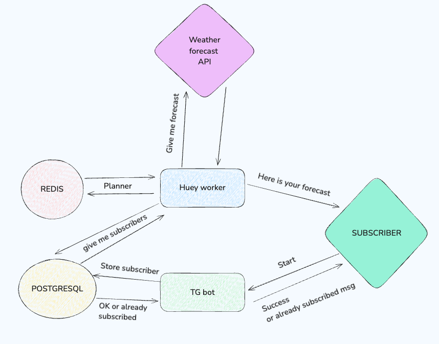

# Weather forecast telegram bot
Weather forecast telegram bot which sends weather forecast to its subscribers on daily bases (two times per day: in the evening and morning).

Main packages which were used:
- pyTelegramBotAPI - to work with telegram API not directly.
- sqlalchemy and alembic - in order to work with database conveniently
- translate - to translate API messages from english to russian.
- huey - for background tasks.

# Components

- config.py - here we store configuration for this project.
- main.py - the main bot initializer and requests handler.
- db/ - here we store our models and repositories to execute queries to database.
- client/ - here we store client to receive and parse weather forecast from API and related utils.

Main scheme:

# Installation
- Use "pyenv" to install and set python version: "^3.9"
- Use poetry to create virtual environment and manage dependencies.

### Env variables

#### Required
`VISUAL_CROSSING_API_KEY` - go to "www.visualcrossing.com" and obtain api key.  
`TELEGRAM_BOT_TOKEN` - go to botfather and obtain your telegram bot token.

`POSTGRES_DB` - database name.  
`POSTGRES_USER` - database user.  
`POSTGRES_PASSWORD` - database password.  
`POSTGRES_HOST` - database host.

#### Non required
`FORECAST_CITY_API_NAME` - if you want to change city for the weather forecast, change it. It should be passed in english.
`FORECAST_CITY_NAME` - if you want ot change city for the weather forecast, change it. It should be set in russian.
`SUCCESSFUL_SUBSCRIPTION_MSG` - allows you to change start message which user sees.  
`SUCCESSFUL_SUBSCRIPTION_MSG` - allows you to change successful message after executing start command by user.
`FORECAST_MESSAGE_FORMAT_EVENING` and `FORECAST_MESSAGE_FORMAT_MORNING` - allow us to change forecast message format.

# Author
Alex Verchenko a.k.a Alex Linus.
Web Site: https://alexlinus.com